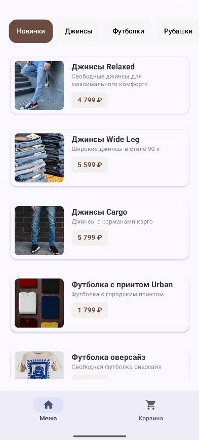
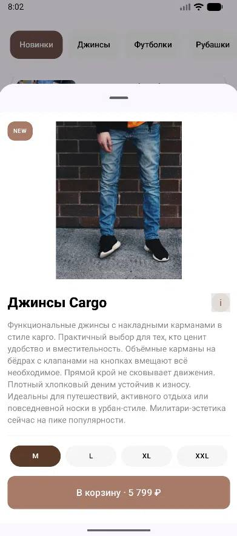
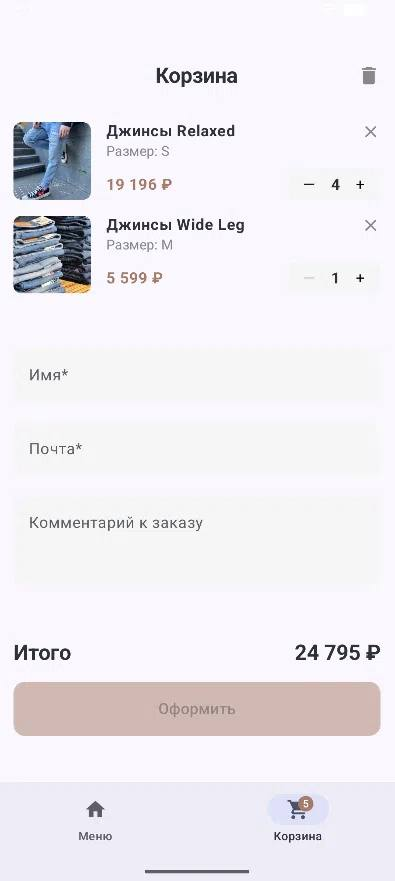

# team-vibe-mobile — Clothing Store

## 📱 О проекте
Мобильное приложение для онлайн-магазина одежды на Android. Позволяет просматривать каталог, фильтровать товары по категориям, добавлять в корзину, изменять количество, оформлять заказ с валидацией имени и email.

## 🎞️ Скриншоты

| Каталог                             | Карточка товара                 | Корзина                          |
|-------------------------------------|---------------------------------|----------------------------------|
|  |  |  |

## 🤖 Архитектура

Приложение построено на **MVVM (Model-View-ViewModel)** с использованием **Repository** паттерна:

- **UI Layer (Compose)** — экраны каталога, корзины, детали товара (BottomSheet)
- **ViewModels** — `CatalogViewModel`, `CartViewModel`
- **Repositories** — `ProductRepository` (API + Room), `CartRepository` (корзина)
- **Data Layer** — Room Database (`AppDatabase`, `CartDatabase`) и Retrofit (`CatalogApi`)

**Cache-first стратегия:** при открытии каталога сначала показываются данные из кэша (Room), параллельно выполняется запрос к API. При успешном ответе кэш и UI обновляются. При отсутствии сети и кэша показывается ошибка.

## 🖥️ Стек технологий

| Компонент | Технология |
|-----------|-----------|
| Платформа | Android |
| Язык | Kotlin |
| UI | Jetpack Compose (Material 3) |
| Загрузка изображений | Coil |
| Асинхронность | Coroutines + Flow |
| Архитектура | MVVM + Repository |
| Сеть | Retrofit + OkHttp |
| Кэширование | Room Database |
| Навигация | Кастомная Bottom Navigation + BottomSheet |
| Сериализация | kotlinx.serialization |
| Линтер | ktlint |
| Тесты | JUnit |

## 👥 Состав команды и роли

| Участник | Роль |
|----------|------|
| Умрилов Егор Алексеевич | TeamLead |
| Жуков Никита Денисович | Backend |
| Проскуренко Тимофей Ильич | UI/UX |
| Кошевой Павел Олегович | UI/UX |

## 🎯 Реализованный функционал

- Загрузка каталога из API с кэшированием в Room
- Cache-first стратегия (сначала кэш, потом API)
- Каталог с фильтрацией по категориям и по тегу «Новинки»
- Детали товара в BottomSheet (изображение, описание, теги, размеры, характеристики, выбор размера)
- Корзина: добавление, увеличение/уменьшение количества, удаление, очистка
- Бейдж с количеством товаров на иконке корзины
- Оформление заказа с валидацией имени (буквы, пробелы, дефис, апостроф) и email
- Обработка состояний загрузки и ошибок (отсутствие сети, ошибка API)
- Поворот экрана и восстановление состояния (через SavedStateHandle)
- Линтер ktlint
- Unit-тесты (маппинг сущностей, фильтрация товаров, форматирование цены)

## ❓ Инструкция по сборке

**Требования:**
- Android Studio (последняя стабильная версия)
- JDK 11 или новее
- Android SDK (minSdk = 24, targetSdk = 36)

**Шаги для сборки:**

1. **Клонирование репозитория**
```bash
git clone https://github.com/FEIP-FEFU-Mobile-Spring-2026/team-vibe-mobile.git
cd team-vibe-mobile
```
2. **Открытие в Android Studio**
* File → Open → выберите папку team-vibe-mobile
* Дождитесь синхронизации Gradle
3. Сборка проекта
* Через IDE: Build → Make Project (Ctrl+F9)
* Через терминал: ./gradlew assembleDebug
4. Запуск приложения
* Подключите устройство или запустите эмулятор
* Нажмите Run (зелёная стрелка) или Shift + F10 
5. Запуск линтера и тестов
```bash
./gradlew ktlintCheck # проверка стиля кода
./gradlew ktlintFormat # автоисправление стиля
./gradlew test # запуск всех тестов
```

### ⚠️ Если ветка не видна после клонирования проекта
**Решение:**
1. Подтянуть все удалённые ветки
    ```bash
    git fetch --all
    ```
2. Создать локальную ветку на основе удалённой и переключиться на неё
    ```bash
    git checkout -b <Название ветки> origin/<Название ветки>
    ```
3. Проверить, что вы в правильной ветке
    ```bash
    git branch --show-current  # должно вывести: <Название ветки>
    ```
   
## ✅ Статус
Проект полностью готов к сдаче. Все 6 блоков выполнены.